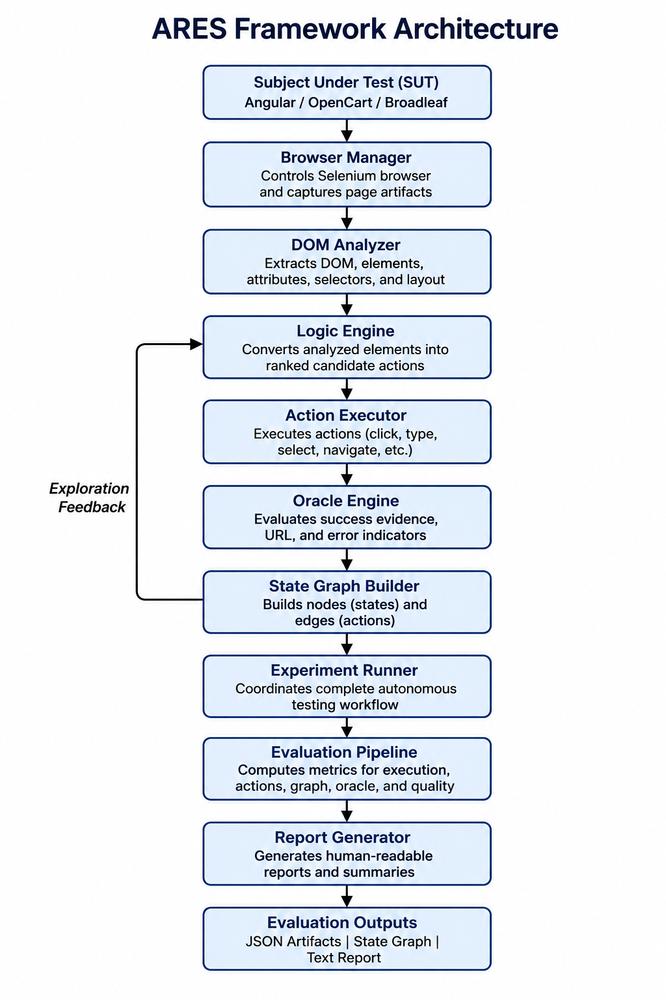

# ARES: An Autonomous End-to-End Web Test Generation Framework with Proactive Self-Healing

## Overview

ARES is a research prototype for autonomous web application testing. The framework automatically analyzes a web application's interface, infers executable user actions, constructs workflow state transitions, executes multi-step navigation, validates outcomes using lightweight oracles, and generates reproducible evaluation artifacts.

This repository accompanies the ARES conference submission and contains the complete implementation used for the experimental evaluation.

---

## Framework Pipeline

<p align="center">
  
</p>

**Figure.** Overall architecture of the implemented ARES conference artifact. The framework automatically analyzes the target application, infers executable actions, executes workflows, validates outcomes through oracle evaluation, constructs state transitions, computes execution metrics, and generates reproducible evaluation artifacts.
---

# Repository Structure

```
ARES-Conference-Artifact/

applications/
    angular/
    broadleaf/
    opencart/

evaluation/
    run_opencart_conference.py
    run_broadleaf_conference.py
    run_angular_conference.py

runner/
    core/
        browser_manager.py
        dom_analyzer.py
        logic_engine.py
        experiment_runner.py
        oracle_engine.py

results/

Figures/

paper/
```

---

# Features

- Automatic DOM analysis
- Action inference
- Workflow execution
- State transition tracking
- Lightweight oracle validation
- Multi-SUT evaluation
- Automatic report generation
- Conference artifact reproduction

---

# Evaluated Systems

The framework was evaluated on three representative web applications.

| System | Technology |
|---------|------------|
| OpenCart 3.0.3.8 | PHP |
| Broadleaf Commerce 6.2 | Spring Boot |
| Angular Demo Store | Angular |

---

# Experimental Results

| System | Actions Inferred | Actions Executed | Successful | States | Transitions | Oracle Pass Rate |
|---------|----------------:|----------------:|-----------:|-------:|------------:|-----------------:|
| OpenCart | 239 | 4 | 4 | 5 | 4 | 100% |
| Broadleaf Commerce | 188 | 4 | 4 | 4 | 4 | 100% |
| Angular Demo | 20 | 4 | 4 | 4 | 4 | 100% |

---

# Requirements

- Python 3.12+
- Google Chrome
- ChromeDriver
- Docker Desktop
- Node.js (Angular)
- Java 17 (Broadleaf)

---

# Installation

Clone the repository.

```bash
git clone <repository-url>
cd ARES-Conference-Artifact
```

Install Python packages.

```bash
pip install -r requirements.txt
```

---

# Running OpenCart

Start the containers.

```bash
docker start ares-opencart-db
docker start ares-opencart-web
```

Run evaluation.

```bash
PYTHONPATH=. python evaluation/run_opencart_conference.py
```

---

# Running Broadleaf

Start Solr.

```bash
docker start ares-broadleaf-solr
```

Start Broadleaf.

```bash
docker start ares-broadleaf-site
```

Run evaluation.

```bash
PYTHONPATH=. python evaluation/run_broadleaf_conference.py
```

---

# Running Angular

Start the Angular application.

```bash
cd applications/angular/ares-angular-sut
npm install
npm start
```

Run evaluation.

```bash
PYTHONPATH=. python evaluation/run_angular_conference.py
```

---

# Generated Artifacts

Each evaluation automatically generates:

```
raw_result.json
evaluation_summary.json
conference_report.txt
```

These files contain:

- inferred actions
- executed workflow
- oracle outcomes
- state transitions
- execution statistics

---

# Conference Artifact

This repository contains the implementation accompanying the ARES conference submission.

The artifact demonstrates:

- automatic action inference
- workflow execution
- oracle validation
- state graph construction
- reproducible evaluation

across multiple web applications.

---

# Citation

If you use this artifact, please cite the accompanying ARES paper.

```
BibTeX will be added after publication.
```

---

# License

This repository is released for academic and research purposes.